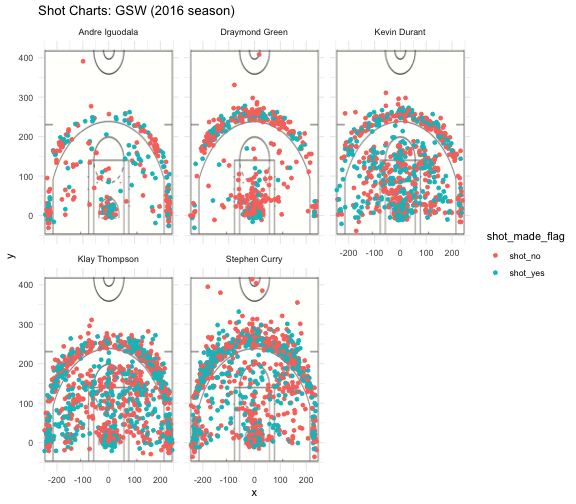

#Introduction:
Golden State Warriors is the home basketball team of the Bay Area and is the No.1 team in the Western Conference with a two-year winning streak in the playoffs. In the 2016-2017 season, it has an insane win rate of 81.7% with stars like Stephen Curry and Draymond Green. As of December 14th, 2017, the Golden State Warriors was on pace for 64 wins. Under the head coach Steve Kerr, this is their lowest total in four seasons. However, they are still on track to meet their goal. The Warriors have won seven straight games. Even when their most important offensive player, Stephen Curry, was not there for the last three games due to illness, as well as their most important defensive player, Draymond Green, for the last two games. 
In this report, I will explore the relationship between Golden State Warriors’ success and its shooting data. I will perform data cleaning, data analysis, and data visualization as supporting documents to illustrate my arguments.


Here is a picture of the "Death Lineup":
From top left to bottom right: Andre Iguodala, Draymond Green, Stephen Curry, Kevin Durant, Klay Thompson


#Motivation:
The main motivation of the report is to produce a data analysis on the shooting chart's data of five players of the Golden State Warriors. Given the data that we have on hand, how does the team achieve their current success and how is the team scoring in each game. In order to this, I will analyze the individual shooting reports of five Golden State Warriors’ players.

#Background:
The background of these data is that I initially downloaded the CSV file of the shooting data of the five players of the Golden State Warriors from the stat-133 GitHub repository. The players are Andre Iguodala, Draymond Green, Kevin Durant, Klay Thompson, Stephen Curry and imported them into RStudio as an individual data frame. In each data frame, it has the following columns, the team’s name, the date of the game, the season of the game, period of the game, minutes remaining in such period, seconds remaining in such period, if the shot made it (yes or no), the type of the action, the type of the shot, the distance from where the player made the shot to the basket, the opponent team, the x and y coordinates of where the player is.
My personal background in basketball is not very deep so I apologize if any mistakes/confusion I caused during this analysis. However, I do support the Golden State Warriors and have been exposed to the upheaval morale of the team and its fans through my roommate.

#Data:
After I imported the five players’ individual data into RStudio, I performed data cleaning on them to make sure they are ready for analysis. First, I added a column “name” to each of the imported data frames that contain the name of the corresponding player. The purpose of this is to differentiate each data frame from each other as well as for future data analysis such as grouping the data table. Second, I replace the syntax of `‘y’` and `‘n’` in the `shot_made_flag` column with more descriptive values `’shot_yes’` and `’shot_no’`, respectively. Third, I add a column named `minute` to calculate the actual minute when the shot was made. Last but not least, I produced a summary text file in the `output/` folder for each player. I also bind all the data frame into one data frame and export it as a CSV file called `shots-data.csv` in the folder `data/`.

#Analysis:
The first part of the analysis I performed is data visualization. You can find the related codes in the document  `make-shot-charts-script.R` and it’s saved in the `code/` folder, for further reference. First, I downloaded a picture of the half court of basketball as the background picture of my illustration. Then I use the package `ggplot` to plot the coordinates of where the players made the shot. I also used two different colors to illustrate if the player has made it into the hoop or not. As a result, I was able to produce the shot charts for each player, which is in the folder `images/`. The second thing I was able to produce was the facetted shot chart which has the five charts side by side, better to cross-analyze. 
Looking at the finished result of the facetted chart `”Shot Charts: GSW (2016 season)”`, we can see the shot charts of the **SuperDeath Lineup**, or the **“Hamptons Five”**.that Andre Iguodala made the fewest shots. However, that’s because he is a defensive player and the main job of his is not to score, but rather to protect the shooting guards.

```{r echo = FALSE, message=F, warning=F}
library(dplyr)
```

```{r out.width='80%', echo = FALSE, fig.align='center'}

```
2PT
```{r}
combined <- read.csv("../data/shots-data.csv")
two_pt <- arrange(summarise(group_by(combined, name), total = sum(shot_type == "2PT Field Goal"), made = sum(shot_type =='2PT Field Goal' & shot_made_flag == 'shot_yes'), perc_made = made/total),desc(perc_made))
two_pt
```
3PT
```{r}
three_pt <- arrange(summarise(group_by(combined, name), total = sum(shot_type == "3PT Field Goal"), made = sum(shot_type =='3PT Field Goal' & shot_made_flag == 'shot_yes'), perc_made = made/total),desc(perc_made))
three_pt
```
Effective Shooting
```{r}
effective_shooting <- arrange(summarise(group_by(combined, name), total = length(shot_type), made = sum(shot_made_flag == 'shot_yes'), perc_made = made/total),desc(perc_made))
effective_shooting
```
#Discussion:
In the overall effective shooting rate, Stephen Curry is only ranked No.4 in terms of the percentage of shots that made it in, with a below half percentage, 46%, among the “Death Lineup.” However, Stephen Curry has the highest total shots made, 1250 to be exact. So even though he has a lower percentage made rate than Kevin Durant, he contributed more success shots than he did (Curry contributed 584 shots and Durant contributed 495 shots).

#Conclusion:
Even though the success shot rates of their top five players are not stellar, the team is able to out-perform other NBA teams, mainly due to the reason that collaboration and team work is the No.1 priority of the team's goal. They all compensate each other heavily and is able to, together, come off as the No.1 team in the league.

#Reference:
- <https://www.basketball-reference.com/teams/GSW/>
- <https://www.nba.com/article/2017/12/14/one-team-one-stat-warriors-shooting-better-ever>

