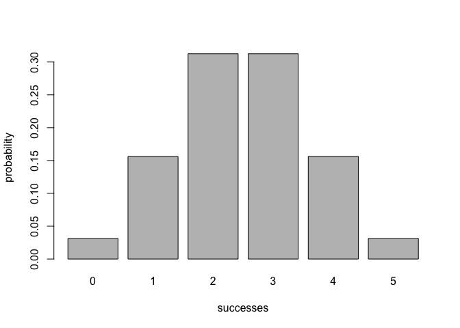
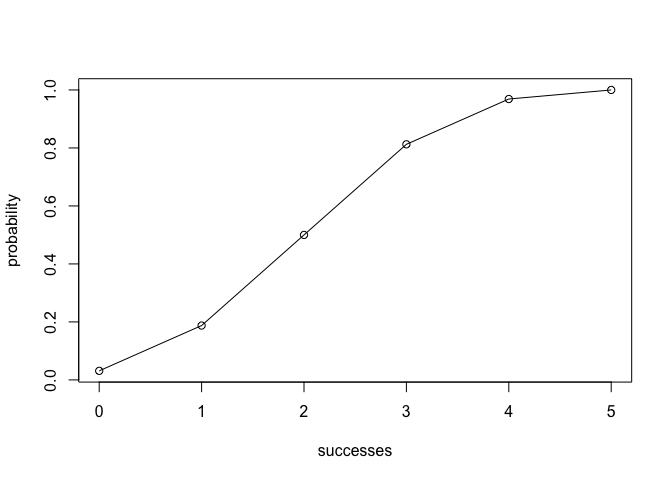

Binomial Package README
================
Zichen Zhao
5/3/2019

Overview
--------

`'binomial'` is a minimal package to implement functions for calculating probabilities of a Binomial random variable, as well as other relevant calculations such as probability distribution, expected value, variance, kurtosis, skewness, etc.

-   `bin_mean()` calculates the mean of the binomial distribution
-   `bin_variance()` calculates the mean of the binomial distribution
-   `bin_mode()` calculates the mean of the binomial distribution
-   `bin_skewness()` calculates the mean of the binomial distribution
-   `bin_kurtosis()` calculates the mean of the binomial distribution
-   `bin_choose()` calculates the number of combinations in which k successes can occur in n trials.
-   `bin_probability()` calculates the probability in which k successes can occur in n trials.
-   `bin_distribution()` constructs a table of successes and probability.
-   `bin_cumulative()` constructs a table of successes, probability, and cumulative probability.
-   `summary()` summarizes the probability of distribution

Motivation
----------

This package has been developed to illustrate some calculations in binomial random variable.

Installation
------------

Install the development version from GitHub via the package `"devtools"`:

``` r
# development version from GitHub:
#install.packages("devtools") 
# install "binomial" (without vignettes)
devtools::install_github("zichenz/binomial")
# install "cointoss" (with vignettes)
devtools::install_github("ichenz/binomial", build_vignettes = TRUE)
```

Usage
-----

``` r
library(binomial)
#Calculating probability of binomial random variable
bin_choose(n = 5, k = 3)
#> [1] 10
bin_probability(3, 5, 0.5)
#> [1] 0.3125

#Creating a distribution and plotting
dis1 <- bin_distribution(5, 0.5)
plot(dis1)
```



``` r

#Creating a cumulative table and plotting
dis2 <- bin_cumulative(5, 0.5)
plot(dis2)
```



``` r

#Creating a binomial random variable object and its related functions
bin1 <- bin_variable(trials = 5, p = 0.5)
bin1
#> "Binomial variable"
#> 
#> Parameters
#> - number of trials:  5
#> - prob of success : 0.5
binsum1 <- summary(bin1)
binsum1
#> "Summary Binomial"
#> 
#> Parameters
#> - number of trials:  5
#> - prob of success : 0.5
#> 
#> Measures
#> - mean    :  2.5
#> - variance:  1.25
#> - mode    :  3
#> - skewness:  0
#> - kurtosis:  -0.4
```
